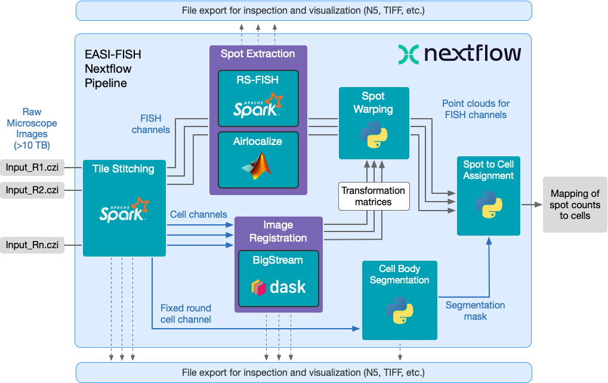

# EASI-FISH Nextflow Pipeline

This pipeline analyzes imagery collected using the [EASI-FISH](https://github.com/multiFISH/EASI-FISH) (Expansion-Assisted Iterative Fluorescence *In Situ* Hybridization) method described in [this Cell paper](https://doi.org/10.1016/j.cell.2021.11.024). It includes automated image stitching, distributed multi-round image registration, cell segmentation, and distributed spot detection.

## Documentation

Full documentation is available at <https://janeliascicomp.github.io/multifish>.

## Command-line Quick Start

For tech-saavy users, the pipeline can be invoked from the command-line and runs on any workstation or cluster. The only prerequisites for running this pipeline are [Nextflow](https://www.nextflow.io) (version 20.10.0 or greater) and [Singularity](https://sylabs.io) (version 3.5 or greater). If you are running on an HPC cluster, ask your system administrator to install Singularity on all the cluster nodes. Singularity is a popular HPC containerization tool, so many institutional clusters already support it.

To [install Nextflow](https://www.nextflow.io/docs/latest/getstarted.html):

    curl -s https://get.nextflow.io | bash 

To [install Singularity](https://sylabs.io/guides/3.7/admin-guide/installation.html) on CentOS Linux:

    sudo yum install singularity

Clone this repository with the following command:

    git clone --recursive https://github.com/JaneliaSciComp/multifish.git

Before running the pipeline for the first time, run setup to pull in external dependencies:

    ./setup.sh

You can now launch the pipeline using:

    ./main.nf [arguments]
