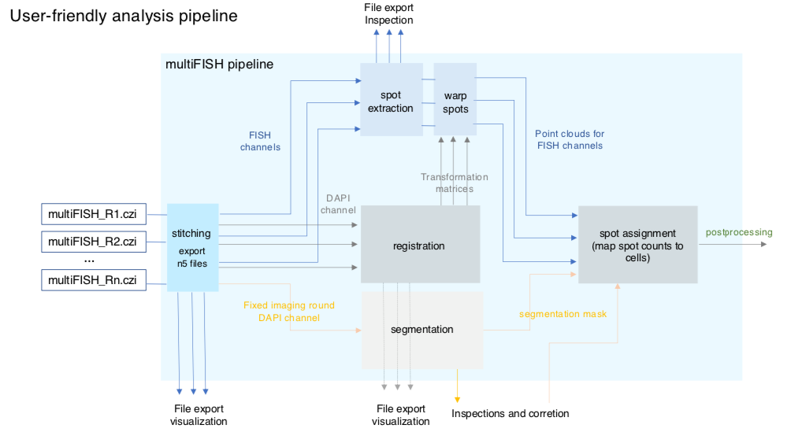

# EASI-FISH Nextflow Pipeline

The purpose of this pipeline is to analyze imagery collected using [EASI-FISH](https://github.com/multiFISH/EASI-FISH) (Expansion-Assisted Iterative Fluorescence *In Situ* Hybridization). It includes automated image stitching, distributed multi-round image registration, cell segmentation, and distributed spot detection. 

## Quick Start

The only software requirements for running this pipeline are [Nextflow](https://www.nextflow.io) (version 20.10.0 or greater) and [Singularity](https://sylabs.io) (version 3.5 or greater). If you are running in an HPC cluster, ask your system administrator to install Singularity on all the cluster nodes.

To [install Nextflow](https://www.nextflow.io/docs/latest/getstarted.html):

    curl -s https://get.nextflow.io | bash 

Alternatively, you can install it as a conda package:

    conda create --name multifish -c bioconda nextflow

To [install Singularity](https://sylabs.io/guides/3.7/admin-guide/installation.html) on CentOS Linux:

    sudo yum install singularity

Clone the multifish repository with the following command:

    git clone https://github.com/JaneliaSciComp/multifish.git

Before running the pipeline for the first time, run setup to pull in external dependencies:

    ./setup.sh

You can now launch the pipeline using:

    ./main.nf [arguments]

## Demo Data Sets

To get running quickly, there are demo scripts available which download EASI-FISH example data and run the full pipeline. You can analyze the smallest data set like this:

    ./examples/demo_small.sh <data dir> [arguments]

The `data dir` is the path where you want to store the data and analysis results. You can add additional arguments to skip steps previously completed or add monitoring with [Nextflow Tower](https://tower.nf). See below for additional details about the argument usage.

The script will download a small [demo data set](https://doi.org/10.25378/janelia.c.5276708.v1) and run the full analysis pipeline. It is tuned for a 40 core machine with 128 GB of RAM. If your compute resources are different, you may need to edit the script to change the parameters to suit your environment. 

After the pipeline runs, you can expect to find 82 GB in the data dir:
```
23G     /opt/demo_small/inputs
58G     /opt/demo_small/outputs
525M    /opt/demo_small/spark
```

There is also a `demo_medium.sh` with larger data that requires 209 GB in total:
```
65G     /opt/demo_medium/inputs
145G    /opt/demo_medium/outputs
665M    /opt/demo_medium/spark
```

## Pipeline Overview

This pipeline is containerized and portable across the various platforms supported by [Nextflow](https://www.nextflow.io). So far it has been tested on a standalone workstation and the Janelia compute cluster (IBM Platform LSF). If you run it successfully on any other platform, please let us know so that we can update this documentation.

The pipeline includes the following modules:
* **stitching** - Spark-based distributed stitching pipeline
* **spot_extraction** - Spot detection using hAirlocalize
* **segmentation** - Cell segmentation using Starfinity 
* **registration** - Bigstream distributed registration pipeline
* **warp_spots** - Warp detected spots to registration
* **intensities** - Intensity measurement
* **assign_spots** - Mapping of spot counts to segmented cells



## Required Parameters

The following parameters are required to run the full pipeline. See the [parameter documentation](docs/Parameters.md) for a complete list of all possible options.

| Argument   | Description                                                                           |
|------------|---------------------------------------------------------------------------------------|
| --data_dir | Path to the directory containing the input CZI/MVL acquisition files. | 
| --output_dir | Path to the directory containing pipeline outputs. |
| --acq_names | Names of acquisition rounds to process. These should match the names of the CZI/MVL files found in the data_dir. |  
| --ref_acq | Name of the acquisition round to use as the fixed reference. |

## Pipeline Execution

Nextflow supports many different execution engines for portability across platforms and schedulers. We have tested the pipeline using local execution and using the cluster at Janelia Research Campus (running IBM Platform LSF). 

To run this pipeline on a cluster, all input and output paths must be mounted and accessible on all the cluster nodes. 

### Run the pipeline locally

To run the pipeline locally, you can use the standard profile:

    ./main.nf [arguments]

This is equivalent to specifying the localsingularity profile:

    ./main.nf -profile localsingularity [arguments]

### Run the pipeline on IBM Platform LSF 

This example also sets the project flag to demonstrate how to set LSF options.

    ./main.nf -profile lsf --lsf_opts "-P multifish" [arguments]

Usage examples are available in the [examples](examples) directory.

## User Manual

Further detailed documentation is available here:

* [Pipeline Parameters](docs/Parameters.md) 
* [File Organization](docs/FileOrganization.md)
* [Troubleshooting](docs/Troubleshooting.md)
* [Development](docs/Development.md)

## Open Source License

This software is made available under [Janelia's Open Source Software](https://www.janelia.org/open-science/software-licensing) policy which uses the BSD 3-Clause License. 

## DOI References

* Segmentation model: https://doi.org/10.25378/janelia.13624268
* Dataset collection: https://doi.org/10.25378/janelia.c.5276708.v1  
* LHA3_R3: https://doi.org/10.25378/janelia.13622819
* LHA3_R5: https://doi.org/10.25378/janelia.13622828
