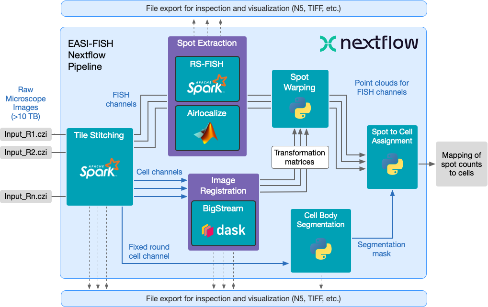

# Overview

## EASI-FISH Pipeline

The purpose of this pipeline is to analyze imagery for spatial transcriptomics collected using [EASI-FISH](https://github.com/multiFISH/EASI-FISH) (Expansion-Assisted Iterative Fluorescence *In Situ* Hybridization). It includes automated image stitching, distributed multi-round image registration, cell segmentation, and distributed spot detection.

## Modules

The pipeline includes the following modules:

* **stitching** - Spark-based distributed stitching pipeline
* **spot_extraction** - Spot detection using Airlocalize
* **segmentation** - Cell segmentation using Starfinity
* **registration** - Bigstream distributed registration pipeline
* **warp_spots** - Warp detected spots to registration
* **measure_intensities** - Intensity measurement
* **assign_spots** - Mapping of spot counts to segmented cells

Some of these modules can be executed individually, using alternative `main-*.nf` scripts in the root project directory. You can also skip individual steps using the `--skip` parameter, as long as the processed data is placed in its expected location for any downstream steps.
