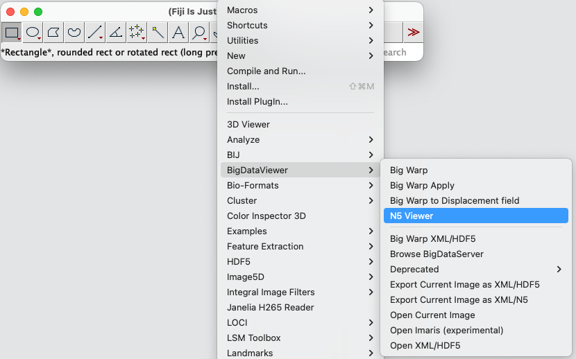
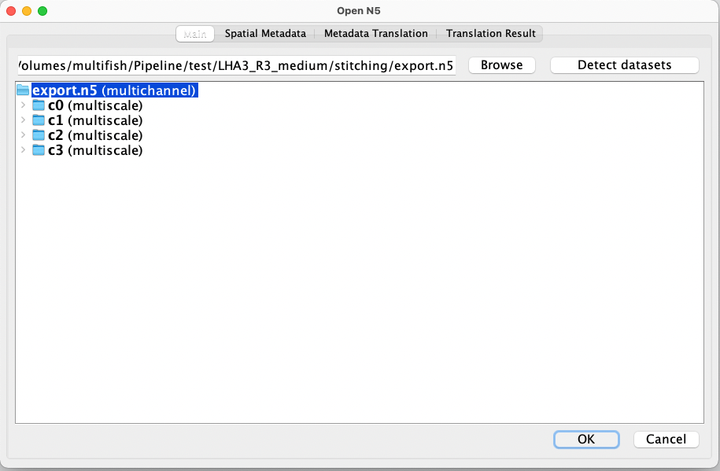
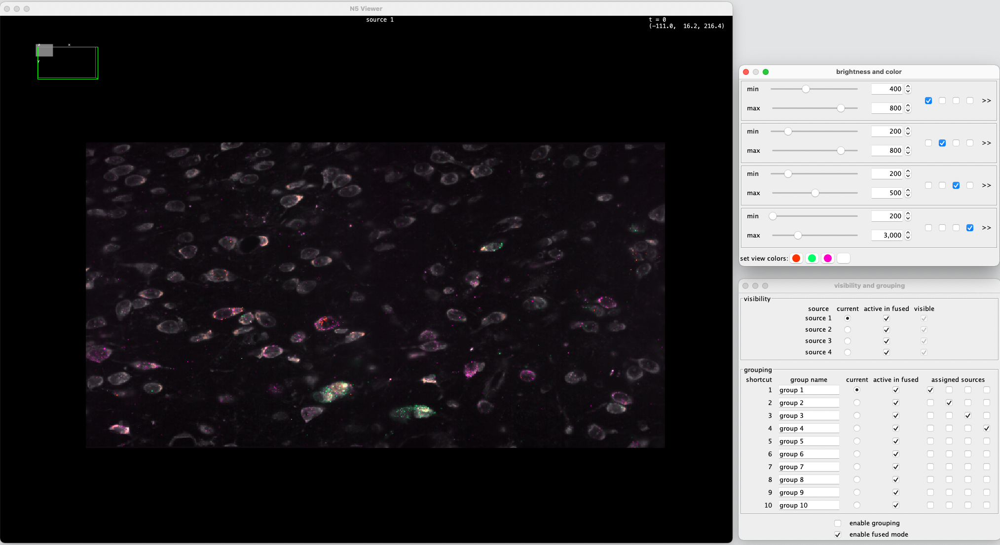
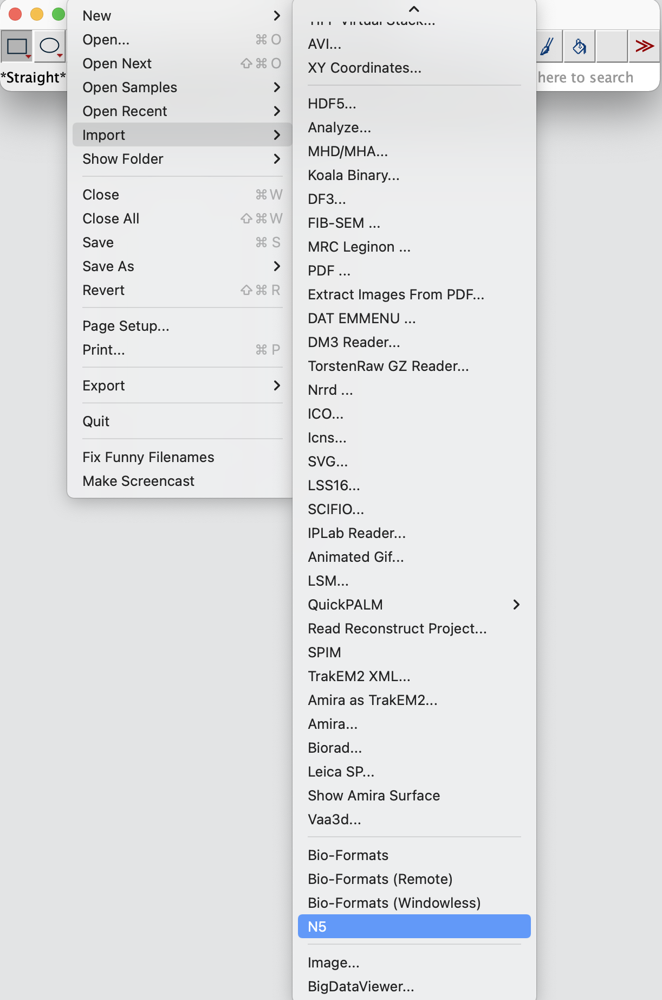
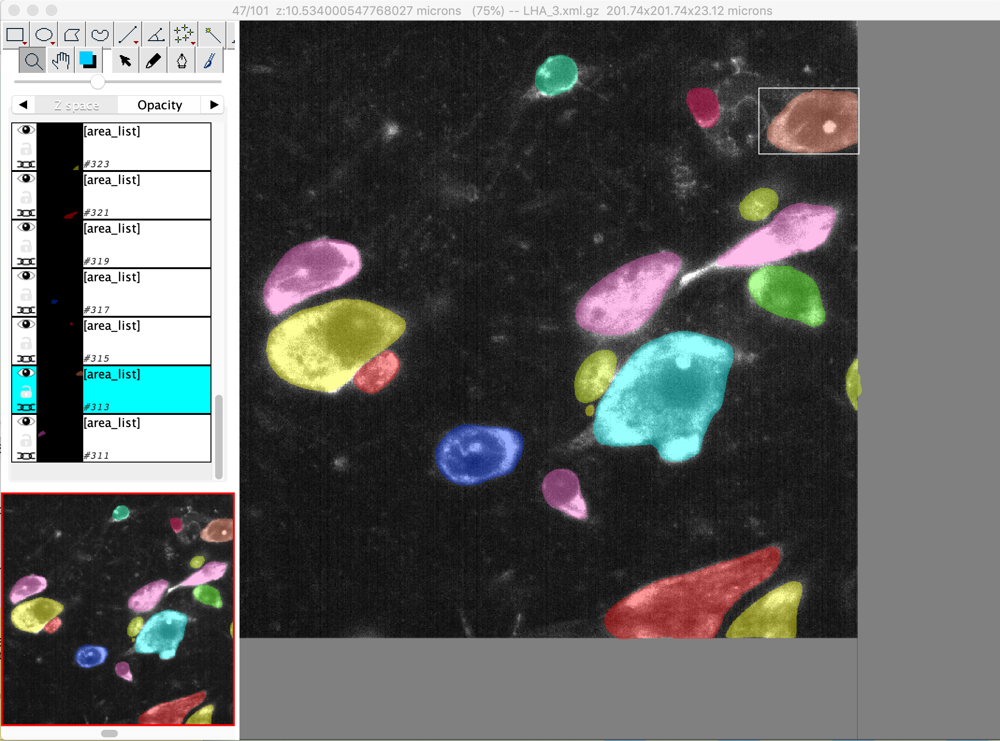
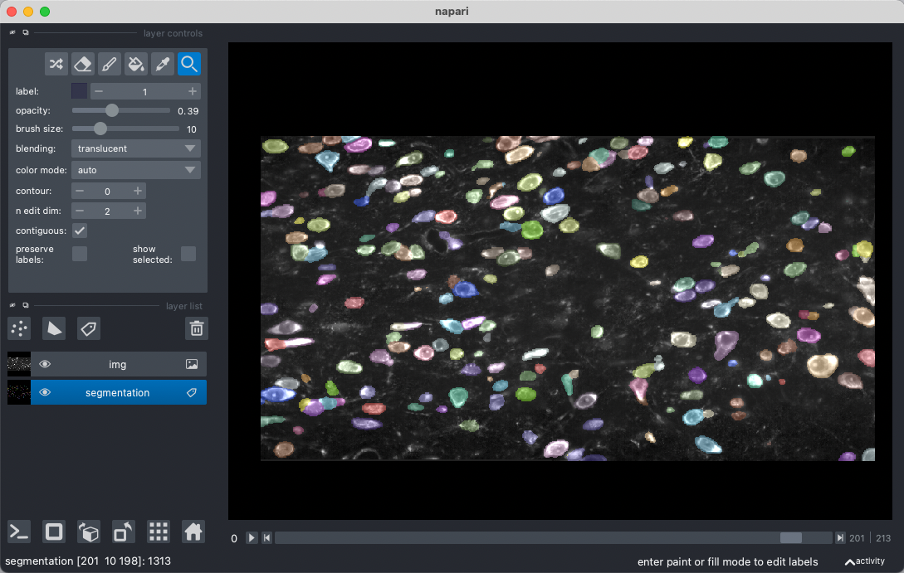
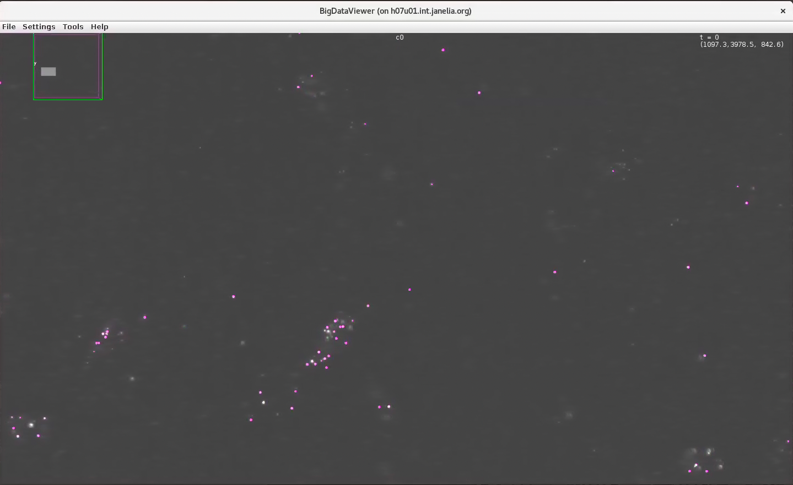

# Data inspection and visualization

EASI-FISH output can be inspected and visualized with BigDataViewer and Napari. For visualization on local workstation, we used n5-viewer and BigDataViewer to visualize full data volumes and [Napari](https://napari.org/) for cell query and raw data to processed data overlay.  

## Visualization of stitching output  

Open [n5-viewer](https://github.com/saalfeldlab/n5-viewer) in [Fiji](https://imagej.net/software/fiji/downloads). 



Browse and load the folder that contains the final stitched result `./stitching/export.n5/`. This should automatically recognize and load all image channels, including both the cytoDAPI channel and FISH channels.  



Now you can navigate and inspect the stitched image volume in 3d with n5-viewer. You can toggle between channels, adjust intensity, rotate the image volume and zoom. Click `show help` for instructions and key shortcuts for n5-viewer.  



## Visualization of registration output

To overlay registered image volume with fixed image volume, we can manually move the registered volume and fixed image volume to the same directory and open as multichannel with n5-viewer, as described above. 

In addition, we can load fixed and registered images separately with n5 Fiji plugin (see below) and use image->color->merge channels to overlay them. This will give us the flexibility to do any image processing in Fiji (such as crop, subset, add scale bar, make measurements, etc) and finally save to any desired file formats. 



Alternatively, we can also visualize them in Napari using python (see below).   

## Visualization of segmentation output

Segmentation mask can be loaded in Fiji and overlay with raw stitched images (load with n5 as described above) for inspection, but we find some issues with color cycling using this approach (failed to display all cell masks in discernable colors due to too many cells). We find [TrakEM2](https://imagej.net/plugins/trakem2/)(Fiji) and Napari (python) are better options for segmentation inspection and manual correction/annotation. 




## Visualization of spot extraction output

To determine the performance of airlocalize and RS-FISH on large dataset, we can overlay detected spots with raw FISH image using BigDataViewer in [RS-FISH plugin](https://github.com/PreibischLab/RS-FISH).
```
    ./csv-overlay-bdv 
    -i '/raw/image/path/export.n5/' # raw image path, n5 file
    -d 'c0'  # channel
    -c '/spot/detection/path/merged_points_c0.txt' # detected spots
    --pointScaling 4.347826086956522,4.347826086956522,2.380952380952381 #convert physical coordinate to pixel coordinate (don't need for RS-FISH output)
```



We can also load chunks of detected spots and raw FISH image in Napari for inspection (see below).

## Data visualization using Napari

We provide [example jupyter notebook](https://github.com/multiFISH/EASI-FISH/blob/master/data_visualization/1_Image_visualization.ipynb) to load data into Napari. For memory considerations on a workstation, users should only attempt to load a subset of the full-resolution image volume, or at a downsampled image scale (for example, the s2, s3 scale in n5 file system). You can also find a youtube video introducing multifish data visualization in Napari [here](https://www.youtube.com/watch?v=QP7ffG9d-do).    

## Cell/spot query using Napari

Because we have the spatial positions of each cell and each FISH spot, we can also search for selected cell(s) in the large data volume. This will be very useful for segmentation inspection and data quality check. An example [notebook](https://github.com/multiFISH/EASI-FISH/blob/master/data_visualization/2_Visualization_by_cell_ID.ipynb) is provided here, please make sure to run [this code](https://github.com/multiFISH/EASI-FISH/blob/master/data_processing/2_ROI_and_spot_extraction.ipynb) first to get cell metadata (position, size, shape, etc.) 
