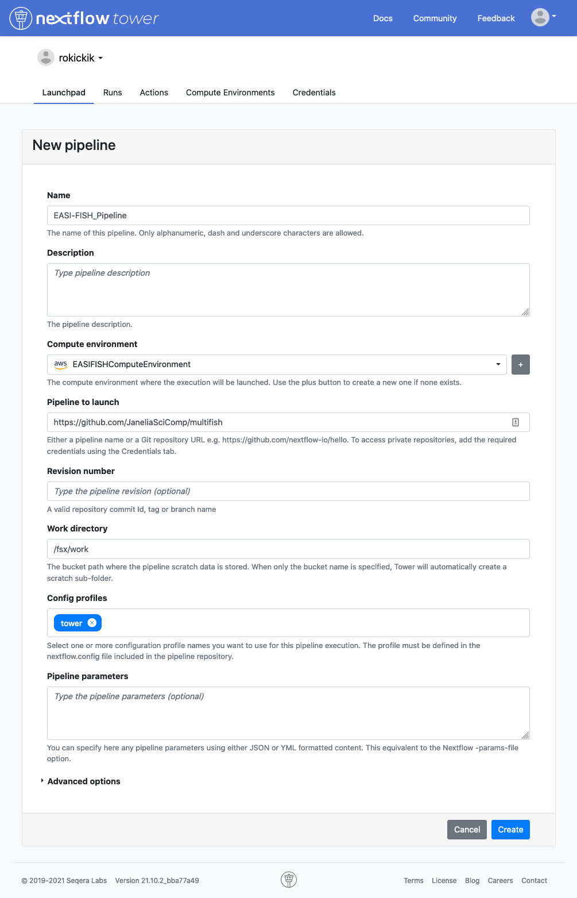

# Nextflow Tower

You can run the pipeline from a web GUI interface known as Nextflow Tower. A public version of Tower is available at [tower.nf](https://tower.nf). Janelia has an internal instance at [nextflow.int.janelia.org](http://nextflow.int.janelia.org).

## Creating a Compute Environment

You (or your system administrator) will first need to create a compute environment in Tower to describe your compute resources. Use the "Tower Forge" method to automatically create the required resources. The official documentation provides [detailed instructions](https://help.tower.nf/compute-envs/aws-batch/#forge-aws-resources) to set this up. Below are some hints for the values that we found works for this pipeline.

## Adding the Pipeline

In the *Launchpad* tab, click **New pipeline** and fill in these values:

## Launching the Pipeline

When you click on the pipeline in the Launchpad, you will see all of the parameters laid out in a web GUI. By default, the parameters will allow you to run the `demo_small` test data set. All you need to do is fill in the `shared_work_dir` to point to your fsx mount (e.g. /fsx/pipeline) and `publish_dir` to point to your mounted S3 bucket (/fusion/s3/bucket-name). This will begin by downloading data in the data_manifest, adn then running the complete analysis pipeline.

### Processing your data

There are two ways to get your data into the pipeline. If your data is available via HTTP (e.g. on Figshare or similar) then you can create a data_manifest and the pipeline will download the data before running.

Alternatively, you can upload the data to your S3 bucket, and then set the `data_dir` parameter to point to it. Click on "Show hidden params" to show this parameter.
