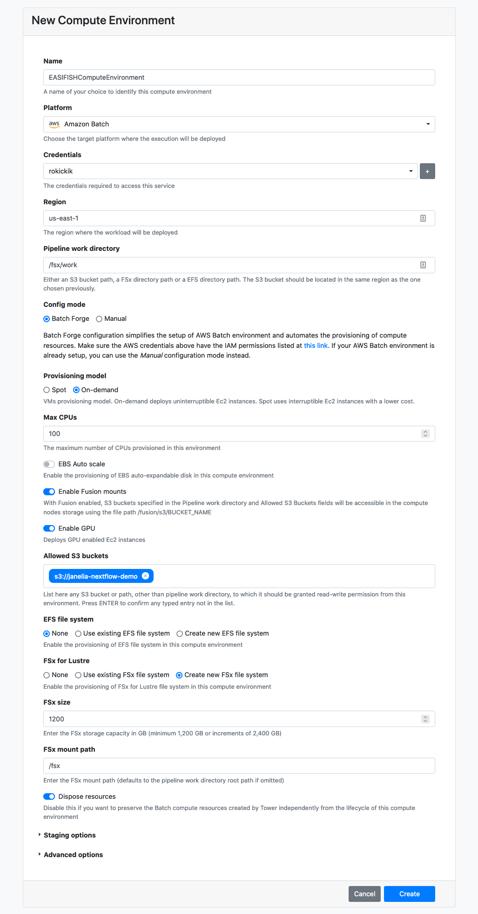

# Running on AWS using Nextflow Tower

A public demonstration version of Tower is available at [tower.nf](https://tower.nf) and can be used to execute the pipeline on any cloud provider. You can log in here:

[Access the Public Nextflow Tower](https://tower.nf){: .btn .btn-blue }

The first time you log in, your account request will need to be approved manually by the Nextflow team. Once you get an email about your account being activated, you'll be able to log in again and run the pipeline.

## Creating a Compute Environment

You will first need to create a compute environment in Tower to describe your compute resources. Use the "Tower Forge" method to automatically create the required resources. The official documentation provides [detailed instructions](https://help.tower.nf/compute-envs/aws-batch/#forge-aws-resources) to set this up. Below are some hints for the values that we found works for this pipeline.

## Adding the pipeline

In the *Launchpad* tab, click **New pipeline** and fill in these values:

## Launching the pipeline

When you click on the pipeline in the Launchpad, you will see all of the parameters laid out in a web GUI. Click "Upload params file" and select one of the JSON files in the examples directory, for example `demo_tiny.json`. This will populate the parameters with the values needed to run the pipeline to process the `demo_tiny` data set.

Fill in the `shared_work_dir` to point to your fsx mount (e.g. /fsx/pipeline) and `publish_dir` to point to your mounted S3 bucket (/fusion/s3/bucket-name). Now click the Launch button. This will begin by downloading data in the data_manifest, and then running the complete analysis pipeline.

### Processing your data

There are two ways to get your data into the pipeline. If your data is available via HTTP (e.g. on Figshare or similar file sharing service) then you can create a data manifest and the pipeline will download the data before running. Look under the `data-sets` directory for examples of how to set this up.

Alternatively, you can upload the data to your S3 bucket, and then set the `data_dir` parameter to point to it. You'll need to click on "Show hidden params" to show this parameter in the web GUI. Also, you should add your S3 bucket to the "Allowed S3 buckets" field on your Compute Environment. The easiest way to do this is to go to the "Compute Environments" tab and click the "Clone" button to make a copy of your environment. Then you can add the S3 bucket to the "Allowed S3 buckets" field on the new environment.
