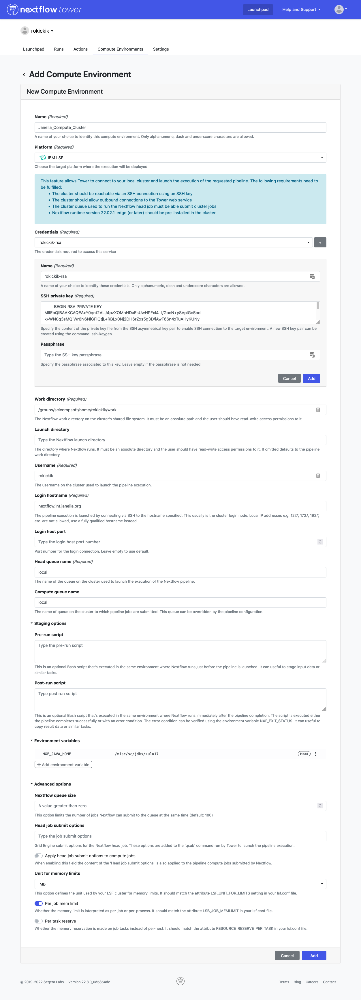
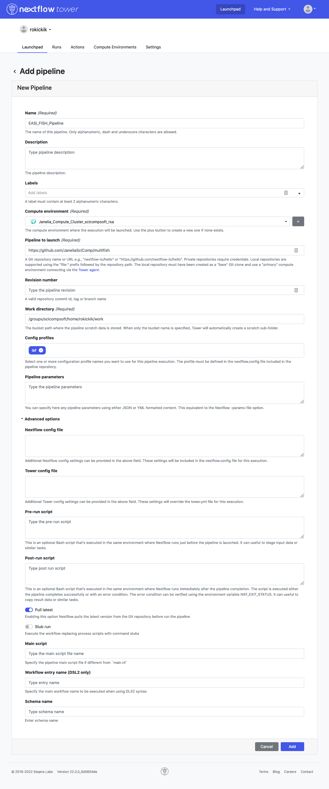

# Running on the LSF Cluster at Janelia using Nextflow Tower

This option requires access to the internal Janelia network.
{: .label .label-yellow }

Janelia has an internal Nextflow Tower installation which can be used to run Nextflow pipelines on the Janelia Compute Cluster. For Janelia users, this option is the most convenient and cost effective way to run the EASI-FISH computational pipeline.

If you are not using Janelia's internal network, you can use the [AWS option](AWS.html) or ask your system administrator to purchase and install [Nextflow Tower](https://seqera.io/tower/) at your institute.

## Getting Started

To get started, submit a help desk ticket to request access to the [Janelia Compute Cluster](https://wiki.int.janelia.org/wiki/display/ScientificComputing/Janelia+Compute+Cluster).

Next, you will need to generate an SSH key pair on the cluster for enable password-less login. Open a terminal and run the following command:

    ssh login1.int.janelia.org

Type `yes` if prompted and enter your password when asked. Now check if you already have an SSH key pair:

    ls -l $HOME/.ssh/id_rsa*

If the result looks something like this, it means you already have an SSH key pair:

    -rw------- 1 yourname yourgroup 1675 Dec  3  2020 /groups/yourgroup/home/yourname/.ssh/id_rsa
    -rw-r--r-- 1 yourname yourgroup  417 Dec  3  2020 /groups/yourgroup/home/yourname/.ssh/id_rsa.pub

If not, you should run the following command to generate an SSH key pair:

    ssh-keygen -t rsa -b 4096 -C "your_email@example.com"

There will be several prompts and you should just hit enter to accept the default value for each one. You can choose to enter a passphrase for more security. Keep track of the passphrase, if any. More detailed information about generating SSH keys can be found [here](https://docs.github.com/en/authentication/connecting-to-github-with-ssh/generating-a-new-ssh-key-and-adding-it-to-the-ssh-agent).

Make sure to add the key to your authorized keys file:

    cat ~/.ssh/id_rsa.pub >> ~/.ssh/authorized_keys
    chmod 700 ~/.ssh/authorized_keys

Next, [install Nextflow](https://www.nextflow.io/docs/latest/getstarted.html) by downloading it and adding it to your path. Type these commands into your terminal, one line at a time:

    cd $HOME
    mkdir -p bin
    curl -s https://get.nextflow.io | bash
    mv nextflow bin/ 
    echo 'export PATH=$PATH:/$HOME/bin' >> .bashrc

Make sure that LSF is also configured in your profile:

    echo '. /misc/lsf/conf/profile.lsf' >> .bashrc

## Login into Tower

You should be able to log into Tower by clicking on the following button and then clicking "Sign in with OpenID Connect". Use your normal Okta login credentials.

[Access the Janelia Internal Nextflow Tower](http://nextflow.int.janelia.org){: .btn .btn-blue }

## Creating a Compute Environment

You will first need to create a compute environment in Tower to describe your LSF cluster access. Click on the "Compute Environments" tab and then select "New Environment".

Make sure to set the following settings:

* Give your environment a name
* Choose "IBM LSF" as the Platform
* In the Credentials section, click on the plus sign (+) and paste in your SSH private key (you can get it from the terminal by running `cat ~/.ssh/id_rsa`) and your passphrase (if you chose to enter one above) and click "Add"
* For the "Work directory", create a folder called "work" in your home folder. To find out where your home folder lives, type `echo $HOME` in the terminal.
* Enter your username
* Set login hostname to `nextflow.int.janelia.org`
* Set both queue names to `local`
* Add an environment variable named `NXF_JAVA_HOME` with the value `/misc/sc/jdks/zulu17`
* Set Unit for memory limits to `MB`
* Enable "Per job mem limit"

Your final settings should look something like this:

## Adding the Pipeline

In the *Launchpad* tab, click **New pipeline**.

* Give the pipeline a name
* Select the compute environment you created
* Set "Pipeline to launch" to `https://github.com/JaneliaSciComp/multifish`
* Under Config profiles enter `lsf`
* Enable "Pull latest"

Your final settings should look something like this:

## Launching the Pipeline

When you click on the pipeline in the Launchpad, you will see all of the parameters laid out in a web GUI. Click "Upload params file" and select one of the JSON files in the examples directory, for example `demo_tiny.json`. This will populate the parameters with the values needed to run the pipeline to process the `demo_tiny` data set.

Fill in the `shared_work_dir` to point to a directory where the intermediate data and final output images should live. It's usually best to put these on NRS, because it's fast and cheaper than DM11. Now click the Launch button. This will begin by downloading data in the data_manifest, and then running the complete analysis pipeline.
